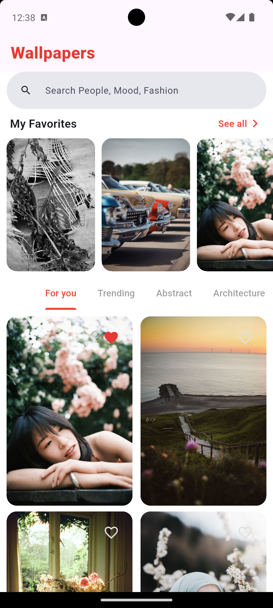
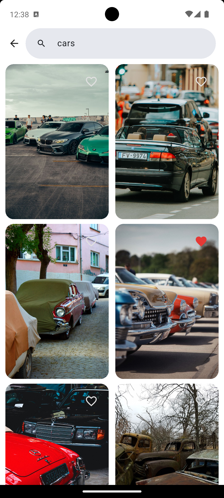
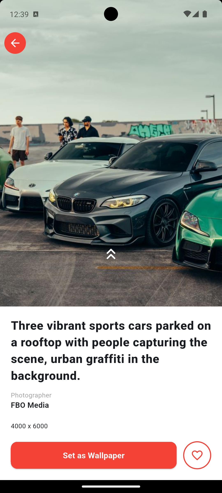
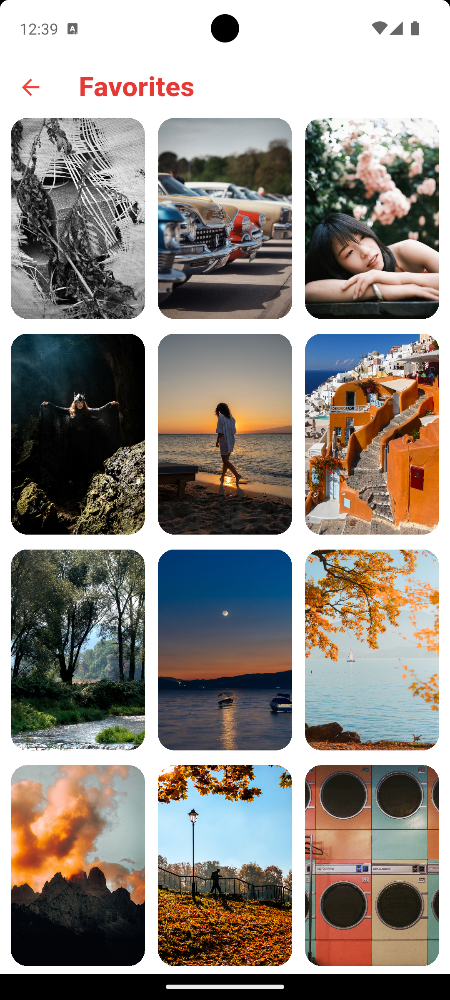
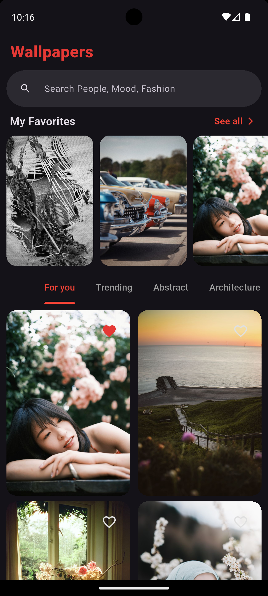
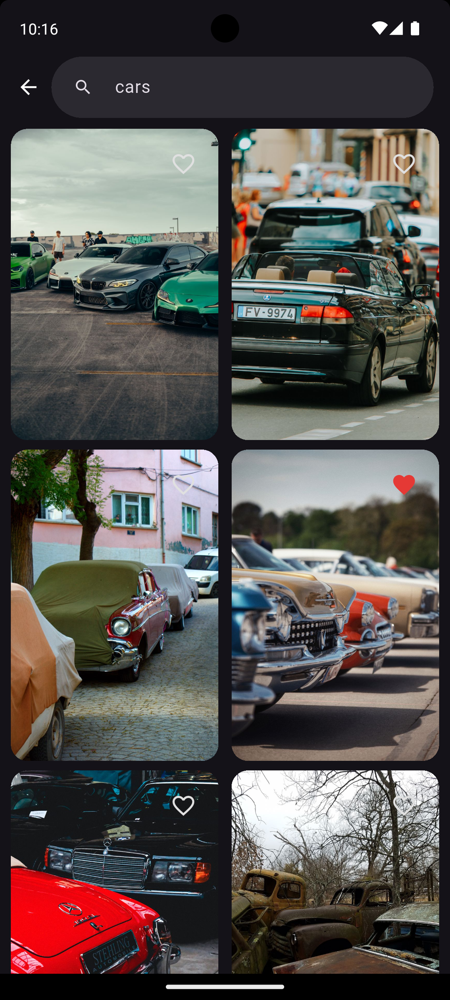
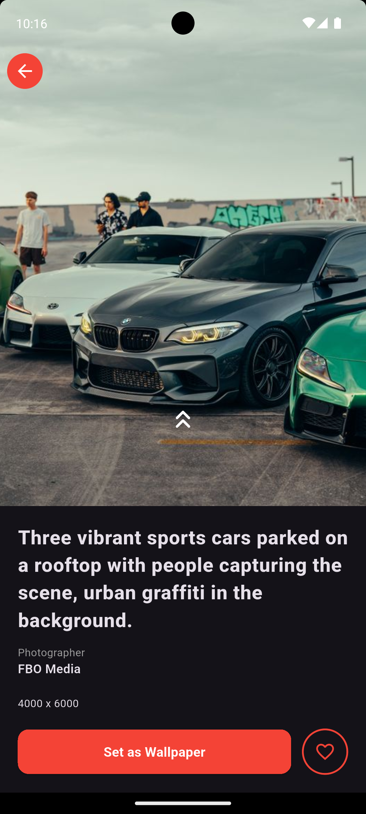
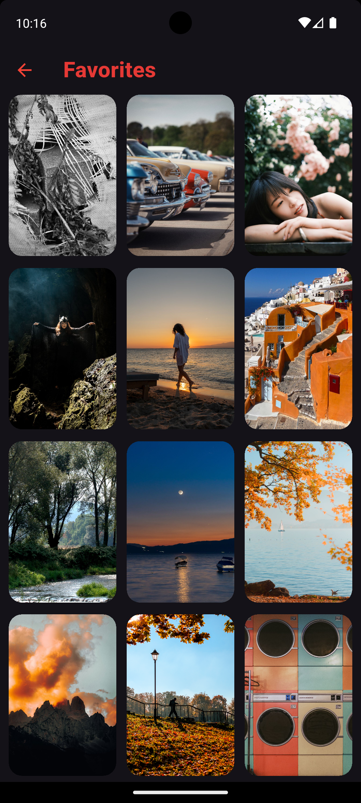

# Wallpaper App

A modern wallpaper browsing and management app built with Flutter on the frontend and a Node.js/Express backend. The app lets users discover wallpapers from multiple categories, search by keyword, save favorites, and set wallpapers directly on their device.

## Overview

Wallpaper App is a full-stack mobile experience that combines:

- a Flutter client for browsing and interacting with wallpapers
- a lightweight backend that proxies requests to the Pexels API
- local persistence for favorite wallpapers using Hive

## Features

- Browse curated wallpapers on the home screen
- Explore wallpapers by category tabs
- Search wallpapers by keyword
- View wallpaper details
- Save wallpapers to favorites
- Set wallpaper as home screen, lock screen, or both
- Smooth state management with BLoC

## Tech Stack

### Mobile App

- Flutter
- Dart
- flutter_bloc
- Hive CE
- cached_network_image
- shimmer
- http

### Backend

- Node.js
- Express.js
- Axios
- dotenv
- CORS

## Project Structure

```text
wallpaper_app/
├── backend/
│   ├── controllers/
│   ├── routers/
│   ├── services/
│   ├── index.js
│   └── package.json
└── mobile_app/
    ├── lib/
    │   ├── config/
    │   ├── features/
    │   ├── main.dart
    │   └── ...
    ├── pubspec.yaml
    └── README.md
```

## Prerequisites

Before running the project, make sure you have:

- Flutter SDK installed
- Dart SDK installed
- Node.js and npm installed
- An Android emulator, iOS simulator, or a physical device
- A Pexels API key

## Backend Setup

1. Navigate to the backend folder:

```bash
cd backend
```

2. Install dependencies:

```bash
npm install
```

3. Create a `.env` file in the backend folder:

```env
PORT=3000
API_KEY=your_pexels_api_key_here
```

4. Start the backend server:

```bash
npm run dev
```

The backend will run on:

```text
http://localhost:3000
```

### Backend API Endpoints

- `GET /api/wallpapers/search?query=nature&page=1`
- `GET /api/wallpapers/curated?page=1`

## Mobile App Setup

1. Navigate to the mobile app folder:

```bash
cd mobile_app
```

2. Install Flutter dependencies:

```bash
flutter pub get
```

3. Run the app:

```bash
flutter run
```

### Important Note for Android Emulator

The app is configured to use:

```dart
http://10.0.2.2:3000
```

This works for Android emulators. If you are running on a physical device or a different emulator setup, update the base URL in the API config file accordingly.

## App Usage

Once the app is running:

- Open the home screen to view wallpapers
- Tap a category to browse themed wallpaper collections
- Use the search bar to find wallpapers by keyword
- Open a wallpaper to view details and set it as your wallpaper
- Use the favorites section to save and revisit favorite wallpapers

## Wallpaper Sections

The app is organized around several wallpaper-focused sections:

### Home Screen

- Displays curated wallpapers and category-based browsing
- Lets users switch between categories such as For you, Trending, Abstract, Nature, and more
- Provides quick access to the search experience

### Search Screen

- Allows users to search wallpapers by keyword
- Shows results dynamically as the user searches
- Supports pagination and empty-state handling for no-result searches

### Wallpaper Detail Screen

- Shows a larger view of the selected wallpaper
- Includes actions to set the wallpaper for the home screen, lock screen, or both
- Allows users to add or remove the wallpaper from favorites

### Favorites Screen

- Stores liked wallpapers locally using Hive
- Lets users revisit and manage favorite wallpapers easily

## Screenshots

The screenshots show:

- Home screen with wallpaper categories
- Search screen with search results
- Wallpaper detail screen
- Favorites screen

Light Theme:

<p align="left">
  
  
  
  
</p>

Dark Theme:

<p align="left">
  
  
  
  
</p>

## Development Notes

- The app follows a clean feature-based folder structure.
- State management is handled with BLoC.
- Favorite wallpapers are persisted locally with Hive.
- The backend acts as a proxy to the Pexels API and keeps the API key secure on the server side.

## Contributing

Contributions are welcome. If you want to improve the app:

1. Fork the repository
2. Create a feature branch
3. Make your changes
4. Open a pull request

## License

This project is licensed under the ISC License.
